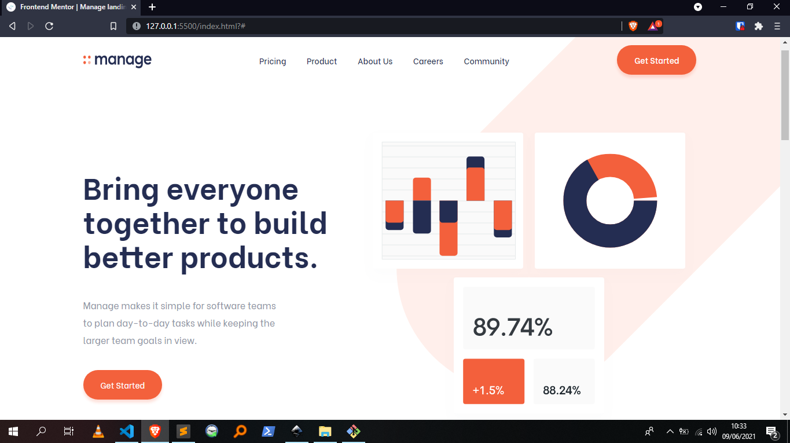
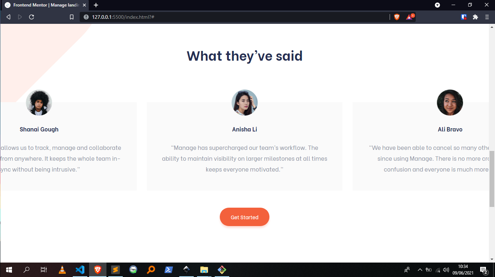

# Frontend Mentor - Manage landing page solution

This is a solution to the [Manage landing page challenge on Frontend Mentor](https://www.frontendmentor.io/challenges/manage-landing-page-SLXqC6P5). Frontend Mentor challenges help you improve your coding skills by building realistic projects.

## Table of contents

-  [Overview](#overview)
   -  [The challenge](#the-challenge)
   -  [Screenshots](#screenshots)
   -  [Links](#links)
-  [My process](#my-process)
   -  [Built with](#built-with)
   -  [What I learned](#what-i-learned)
   -  [Continued development](#continued-development)
   -  [Useful resources](#useful-resources)
-  [Author](#author)

## Overview

### The challenge

Users should be able to:

-  View the optimal layout for the site depending on their device's screen size
-  See hover states for all interactive elements on the page
-  See all testimonials in a horizontal slider
-  Receive an error message when the newsletter sign up `form` is submitted if:
   -  The `input` field is empty
   -  The email address is not formatted correctly

### Screenshots



Screenshot of the top section of the page. Showing the navigation bar and the hero section of the page.



Screenshot of the testimonials section of the page. The testimonials slide horizontally.

### Links

-  Solution URL: [Coming soon](https://your-solution-url.com)
-  Live Site URL: [Coming soon](https://your-live-site-url.com)

## My process

### Built with

-  Semantic HTML5 markup
-  [SASS](https://sass-lang.com/) - Give your CSS superpowers
-  Flexbox
-  CSS Grid
-  Mobile-first workflow
-  [Inkscape](https://inkscape.org) - Inkscape: Open Source Scalable Vector Graphics Editor

### What I learned

I learned how to Google more for things I had a hard time implementing and to find solutions to any problems I encountered.

Halfway done with the project, I discovered the [Flickity](https://flickity.metafizzy.co/) plugin.

Adding the plugin with the one line of code below to my project, really saved me a tonne of time coding the sliders on my own.

This, in turn, resulted in some beautiful and highly customizable sliders.

```html
<script src="https://unpkg.com/flickity@2/dist/flickity.pkgd.min.js"></script>
```

### Continued development

I want to focus on learning CSS grid and writing more semantic code in future projects.

### Useful resources

Resources I found most helpful while building this challenge:

-  [MDN Reference](https://developer.mozilla.org/en-US/) - Resources for developers, by developers. Don't know what the _transform_ property does? Or what the difference between _position: relative_ and _position: absolute_ are? Then, the MDN Docs will clear things up for you.

-  [CSS-TRICKS](https://css-tricks.com/snippets/css/complete-guide-grid/) - A Complete Guide to Grid. The name says it all. If you want to understand CSS Grid much better, this is the article to read.

-  [Flickity](https://flickity.metafizzy.co/) - Touch, responsive, flickable carousels. I highly recommend this to anyone who has a hard time implementing sliders in their projects.

-  [Inkscape](https://inkscape.org) - Inkscape SVG Editor. I use it all the time when I'm working on any web project. For this project, I loaded the project designs into Inkscape and used it's in-built tools to figure out the _spacing_, _sizing_ and _positioning_ of elements throughout the project.

Going through such resources to look up things I didn't understand or know has made me better prepared to tackle future projects.

## Author

-  Github - [@AllanKirui](https://www.github.com/AllanKirui)
-  Frontend Mentor - [@AllanKirui](https://www.frontendmentor.io/profile/AllanKirui)
-  Instagram - [@nallawilljr](https://www.instagram.com/nallawilljr)
